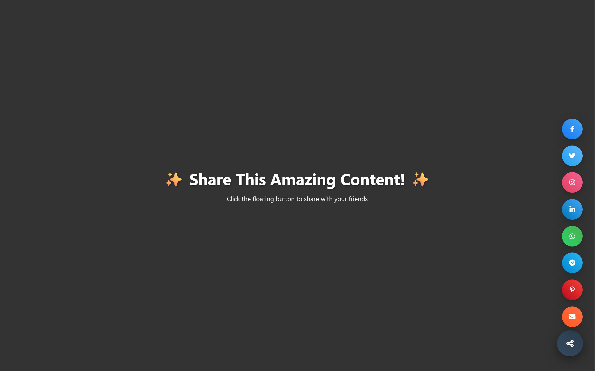

# SoMuchSharing - Floating Share Widget ✨

A beautiful, interactive floating social media sharing widget with stunning animations and confetti effects. Share your content across multiple platforms with style!

  



## 🌟 Features

- **Floating Design**: Elegant floating button that stays visible while browsing
- **Multiple Platforms**: Share on Facebook, Twitter, Instagram, LinkedIn, WhatsApp, Telegram, Pinterest, and Email
- **Smooth Animations**: Beautiful CSS animations with cubic-bezier easing
- **Confetti Effects**: Celebratory confetti explosion when sharing
- **Responsive Design**: Works perfectly on desktop and mobile devices
- **Customizable Position**: Choose between left or right positioning
- **Interactive Tooltips**: Hover tooltips for each social platform
- **Keyboard Support**: ESC key to close the widget
- **Touch Gestures**: Swipe support for mobile devices
- **Pulse Animation**: Attention-grabbing pulse effect on the main button
- **Success Feedback**: Visual confirmation when content is shared

## Quick Start

### Installation

1. **Download the files**:
   ```bash
   git clone https://github.com/tuxedosoft/SoMuchSharing.git
   cd somuchsharing
   ```

2. **Include in your HTML**:
   ```html
   <!DOCTYPE html>
   <html>
   <head>
       <link rel="stylesheet" href="somuchsharing.css">
       <link rel="stylesheet" href="https://cdnjs.cloudflare.com/ajax/libs/font-awesome/6.0.0/css/all.min.css">
   </head>
   <body>
       <!-- Your content here -->
       
       <!-- Add the widget HTML -->
       <div class="floating-share-widget">
           <div class="share-options" id="shareOptions">
               <button class="share-option facebook" onclick="share('facebook')" style="--delay: 1">
                   <i class="fab fa-facebook-f"></i>
                   <span class="tooltip">Share on Facebook</span>
               </button>
               <!-- Add more social buttons as needed -->
           </div>
           <button class="share-button" id="shareButton" onclick="toggleShare()">
               <i class="fas fa-share-alt"></i>
           </button>
       </div>

       <div class="success-animation" id="successAnimation"></div>
       <div class="confetti-container" id="confettiContainer"></div>

       <script src="somuchsharing.js"></script>
   </body>
   </html>
   ```

3. **Open in browser**:
   Simply open `index.html` in your web browser to see the widget in action!

## Customization

### Widget Configuration

Modify the `widgetConfig` object in `somuchsharing.js`:

```javascript
const widgetConfig = {
    position: 'right',        // 'left' or 'right'
    enableConfetti: true,     // Enable/disable confetti effects
    enablePulse: true,        // Enable/disable pulse animation
    enableFloating: true      // Enable/disable floating animation
};
```

### Changing Widget Position

```javascript
// Change position programmatically
setWidgetPosition('left');  // or 'right'
```

### Customizing Share Content

Modify the `share()` function in `somuchsharing.js`:

```javascript
function share(platform) {
    const url = encodeURIComponent(window.location.href);
    const title = encodeURIComponent('Your Custom Title');
    const text = encodeURIComponent('Your Custom Description');
    
    // ... rest of the function
}
```

### Styling Customization

The widget uses CSS custom properties and can be easily styled by modifying `somuchsharing.css`:

- **Colors**: Update the gradient backgrounds for each social platform
- **Sizes**: Modify button dimensions and spacing
- **Animations**: Adjust animation durations and easing functions
- **Positioning**: Change the floating widget position

## 📱 Supported Platforms

| Platform | Status | Notes |
|----------|--------|-------|
| Facebook | ✅ | Direct sharing via URL |
| Twitter | ✅ | Direct sharing via URL |
| LinkedIn | ✅ | Direct sharing via URL |
| WhatsApp | ✅ | Direct sharing via URL |
| Telegram | ✅ | Direct sharing via URL |
| Pinterest | ✅ | Direct sharing via URL |
| Email | ✅ | Opens default email client |
| Instagram | ⚠️ | Manual copy/paste required |

## 🛠️ Technical Details

### Dependencies

- **Font Awesome 6.0.0**: For social media icons
- **Modern Browser**: ES6+ support required

### Browser Support

- ✅ Chrome 60+
- ✅ Firefox 55+
- ✅ Safari 12+
- ✅ Edge 79+
- ✅ Mobile browsers (iOS Safari, Chrome Mobile)

### File Structure

```
somuchsharing/
├── index.html          # Demo page
├── somuchsharing.css   # Styles and animations
├── somuchsharing.js    # Widget functionality
└── README.md          # This file
```

## Usage Examples

### Basic Implementation

```html
<!-- Minimal implementation -->
<div class="floating-share-widget">
    <div class="share-options" id="shareOptions">
        <button class="share-option facebook" onclick="share('facebook')">
            <i class="fab fa-facebook-f"></i>
        </button>
    </div>
    <button class="share-button" id="shareButton" onclick="toggleShare()">
        <i class="fas fa-share-alt"></i>
    </button>
</div>
```

### Custom Share Content

```javascript
// Override default share content
function share(platform) {
    const url = encodeURIComponent('https://yourwebsite.com');
    const title = encodeURIComponent('Check out my amazing project!');
    const text = encodeURIComponent('I built this awesome floating share widget!');
    
    // ... platform-specific sharing logic
}
```

## Advanced Features

### Keyboard Navigation

- **ESC**: Close the share widget
- **Tab**: Navigate between share options
- **Enter/Space**: Activate share buttons

### Touch Gestures

- **Swipe Up**: Open share widget (mobile)
- **Swipe Down**: Close share widget (mobile)
- **Tap**: Toggle widget state

### Animation Controls

```javascript
// Disable specific animations
widgetConfig.enableConfetti = false;
widgetConfig.enablePulse = false;
widgetConfig.enableFloating = false;
```

## Troubleshooting

### Common Issues

1. **Widget not appearing**: Check if all CSS and JS files are properly linked
2. **Icons not showing**: Ensure Font Awesome CDN is accessible
3. **Sharing not working**: Verify internet connection and platform availability
4. **Mobile issues**: Test touch events and responsive design

### Debug Mode

Add this to your browser console for debugging:

```javascript
// Enable debug logging
console.log('Widget config:', widgetConfig);
console.log('Widget state:', { isOpen, shareButton, shareOptions });
```

## Contributing

We welcome contributions! Please feel free to:

1. Fork the repository
2. Create a feature branch
3. Make your changes
4. Submit a pull request

### Development Setup

```bash
# Clone the repository
git clone https://github.com/yourusername/somuchsharing.git

# Open in your favorite editor
code somuchsharing/

# Start a local server (optional)
python -m http.server 8000
# or
npx serve .
```

## License

This project is licensed under the MIT License - see the [LICENSE](LICENSE) file for details.

## 👨‍💻 Developer

**Tuxedosoft** - [Website](http://tuxedosoft.com)

- **Version**: 1.0.0
- **Released**: August 5th, 2025
- **Last Updated**: August 5th, 2025

## Acknowledgments

- Font Awesome for the beautiful icons
- CSS animations inspired by modern web design trends
- Confetti effect inspired by celebration libraries

---

**Made with ❤️ by Tuxedosoft**

*Share the love! If you find this widget useful, please consider giving it a ⭐ on GitHub.* 
